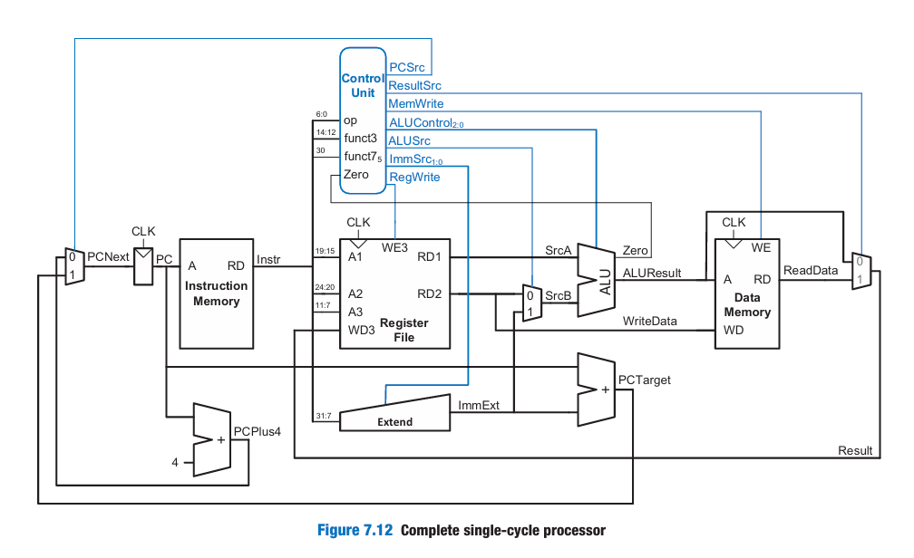

# Design and Implementation of a Single-Cycle and Multi-Cycle RISC-V Processor 

This repository contains **two implementations of a custom RISC-V RV32I processor**:

1. **Single-Cycle Processor**  
2. **Multi-Cycle Processor**

These two RISC-V processor implementations were developed and tested to analyze architectural trade-offs in terms of performance, hardware resource utilization, and control logic complexity.

---

## Table of Contents

1. [Single-Cycle Processor](#single-cycle-processor)  
2. [Multi-Cycle Processor](#multi-cycle-processor)  
3. [Comparison Between the Two](#comparison-between-the-two)  
4. [How to Run the Projects](#how-to-run-the-projects)  
5. [Repository Structure](#repository-structure)  

---

## Single-Cycle Processor

The **Single-Cycle Processor** executes every instruction in **one clock cycle**.  

- **Memory**: Separate instruction memory and data memory (Harvard architecture)  
- **Control**: Combinational logic  
- **Pros**: Simple to understand and implement  
- **Cons**: Long clock period due to critical path  

**Key Features**:  
- Supports R, I, L, S, and SB types  
- Modular design for easy debugging  
- Fully verified with test programs  

For more details, see the [Single-Cycle README](single_cycle/README.md).




---

## Multi-Cycle Processor

The **Multi-Cycle Processor** executes each instruction over **multiple clock cycles**.  

- **Memory**: Unified instruction and data memory (Von Neumann architecture)  
- **Control**: FSM-based control unit  
- **Pros**: Shorter clock period, hardware reuse  
- **Cons**: More complex control  

**Key Features**:  
- Supports R, I, L, S, and SB types  
- Unified memory for instructions and data  
- Fully verified with cycle-by-cycle simulation  

For more details, see the [Multi-Cycle README](multi_cycle/README.md).


---

## Comparison Between the Two

| Feature | Single-Cycle | Multi-Cycle |
|---------|--------------|------------|
| Memory architecture | Harvard (separate) | Unified (Von Neumann) |
| Clock cycles per instruction | 1 | Multiple |
| Clock period | Long | Short |
| Control logic | Combinational | FSM-based |
| Hardware reuse | Low | High |
| Complexity | Low | Medium |

---

## How to Run the Projects

1. Clone the repository:

```bash
git clone https://github.com/Youssef647-gifs/RISC-V_Processor.git
```

2. Open either `single_cycle/` or `multi_cycle/` in a Verilog simulator (ModelSim recommended).  
3. Set the top module:
   - Single-Cycle → `top_tb_PLS` in `P_initialised.v`  
   - Multi-Cycle → `tb_riscv_mult` top module  
4. Run the simulation and observe waveforms to verify instruction execution.

---

## Repository Structure

```
RISC-V_Processor/
├─ single_cycle/
│  ├─ README.md
│  ├─ design/
│  └─ documentation/
├─ multi_cycle/
│  ├─ README.md
│  ├─ rtl/
   ├─ tb/
│  └─ documentation/
├─ README.md  <- this global README
└─ documentation/
   
```

---
## 👥 Contributors

**[AIT MOUNA Youssef]**  
• [NSER El hattab]  
• [LOULID Anas]  

► Special thanks to Mr. Hamzaoui **(ENSA Marrakech)** for his expert mentorship and guidance.

### 🚀 Final Note

This repository provides a **complete educational exploration of RISC-V processor design**, from simple single-cycle to optimized multi-cycle implementations.  
It is ideal for **learning processor architecture, FSM-based control, and memory design trade-offs**.
