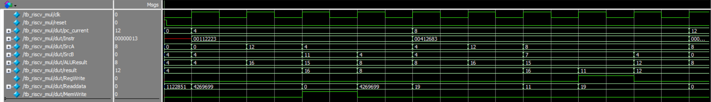

# Multi-Cycle RISC-V Processor

This repository contains the **Verilog implementation of a Multi-Cycle RISC-V RV32I processor**.  
Unlike the single-cycle version, this design uses a **unified memory architecture**, where
**instructions and data share the same memory block**.  
Instruction execution is spread over multiple clock cycles and controlled by a
**Finite State Machine (FSM)**.

This project demonstrates architectural trade-offs between **performance, hardware cost,
and control complexity**, and serves as a complement to the single-cycle implementation.

---

## Table of Contents

1. [Design Overview](#design-overview)  
2. [Architecture Characteristics](#architecture-characteristics)  
3. [Modules Description](#modules-description)  
   - [Program Counter](#program-counter)  
   - [Unified Memory](#unified-memory)  
   - [Register File](#register-file)  
   - [Immediate Generator](#immediate-generator)  
   - [Control Unit (FSM)](#control-unit-fsm)  
   - [ALU](#alu)  
4. [Instruction Execution Flow](#instruction-execution-flow)  
5. [Verification](#verification)  
6. [How to Use](#how-to-use)  
7. [Comparison with Single-Cycle Processor](#comparison-with-single-cycle-processor)  

---

## Design Overview

The **Multi-Cycle RISC-V processor** executes each instruction over several clock cycles.
Each cycle performs a specific phase of instruction execution, such as instruction fetch,
decode, execution, memory access, or write-back.

The processor uses a **unified (Von Neumann) memory architecture**, where the same memory
block stores both instructions and data. Memory accesses are **time-multiplexed** across
different FSM states, avoiding structural hazards.

### Supported Instruction Types
- **R-type**: `add`, `sub`, `and`, `or`  
- **I-type**: `addi`, `ori`  
- **L-type**: `lw`  
- **S-type**: `sw`  
- **SB-type**: `beq`  

<<<<<<< HEAD

=======
)
>>>>>>> de00b9c (Save current changes before pull)

---

## Architecture Characteristics

- Unified instruction and data memory  
- FSM-based control unit  
- Shorter clock period compared to single-cycle design  
- Reuse of functional units across cycles  
- Reduced hardware duplication  

---

## Modules Description

### 1. Program Counter

The **Program Counter (PC)** stores the address of the current instruction.
It is updated only during specific FSM states (instruction fetch or branch completion).

**Inputs**:  
- `clk`, `reset`  
- `PCWrite`, `PCWriteCond`  
- `PCSource`  

**Output**:  
- `PC_out`

---

### 2. Unified Memory

The **Unified Memory** module stores **both instructions and data**.

- During the **Instruction Fetch (IF)** state, the memory is accessed using the PC to fetch
  the instruction.
- During the **Memory Access (MEM)** state, the same memory is used for load (`lw`) and
  store (`sw`) operations.

Because instruction fetch and data access occur in **different clock cycles**, no memory
conflict occurs.

**Inputs**:  
- `clk`, `reset`  
- `MemRead`, `MemWrite`  
- `address`  
- `write_data`  

**Output**:  
- `read_data`

---

### 3. Register File

The **Register File** provides operands during the decode stage and stores results during
the write-back stage.

**Inputs**:  
- `clk`, `reset`  
- `RegWrite`  
- `Rs1`, `Rs2`, `Rd`  
- `Write_data`  

**Outputs**:  
- `Read_data1`, `Read_data2`

---

### 4. Immediate Generator

The **Immediate Generator** extracts and sign-extends immediate values from the instruction
for I-type, S-type, and SB-type formats.

**Input**:  
- `instruction`  

**Output**:  
- `ImmExt`

---

### 5. Control Unit (FSM)

The **Control Unit** is implemented as a **Finite State Machine (FSM)**.
It generates control signals based on the current FSM state and the instruction opcode.

#### FSM States
- Instruction Fetch (IF)  
- Instruction Decode (ID)  
- Execute (EX)  
- Memory Access (MEM)  
- Write Back (WB)  

**Generated control signals include**:
- `PCWrite`, `PCWriteCond`  
- `IRWrite`  
- `MemRead`, `MemWrite`  
- `RegWrite`  
- `ALUSrcA`, `ALUSrcB`  
- `ALUOp`  
- `PCSource`  

---

### 6. ALU (Arithmetic Logic Unit)

The **ALU** performs arithmetic and logical operations during the execute stage.

**Inputs**:  
- `inputA`, `inputB`  
- `ALUOp`  

**Outputs**:  
- `ALUResult`  
- `Zero`

---

## Instruction Execution Flow

| Instruction Type | FSM Sequence |
|-----------------|-------------|
| R-type          | IF → ID → EX → WB |
| I-type          | IF → ID → EX → WB |
| Load (`lw`)     | IF → ID → EX → MEM → WB |
| Store (`sw`)    | IF → ID → EX → MEM |
| Branch (`beq`)  | IF → ID → EX |

---

## Verification

### Test Strategy

The processor was verified using **instruction sequences loaded into unified memory**.
Verification focused on **cycle-by-cycle correctness** of:
- FSM state transitions  
- Control signal generation  
- ALU operations  
- Memory read/write behavior  
- Correct program counter updates  

Registers were initialized with known values to ensure predictable behavior during
verification.

#### Example Test Instructions

memory[0] = 32'b0000000_00001_00010_010_00100_0100011; // sw x1, 4(x2)

memory[1] = 32'b000000000100_00010_010_01101_0000011; // lw x13, 4(x2)

The processor was verified using a simple memory test where a value is stored (sw) and then loaded (lw) from the same memory location. Cycle-by-cycle waveforms confirm correct FSM sequencing, ALU address calculation, memory read/write operations, and register updates. For example, the value of x1 is stored at x2 + 4 and subsequently loaded into x13, demonstrating correct instruction execution across multiple clock cycles.

---

## How to Use

### Running the Code

1. Clone the repository  
2. Open the project in a Verilog simulator (ModelSim recommended)  
3. Set the **tb_riscv_mul** as the simulation top  
4. Run the simulation and observe FSM transitions and datapath activity  

---

## Comparison with Single-Cycle Processor

| Feature | Single-Cycle | Multi-Cycle |
|------|-------------|------------|
| Memory architecture | Harvard | Unified (Von Neumann) |
| Instruction & data memory | Separate | Shared |
| Clock cycles per instruction | 1 | Multiple |
| Clock period | Long | Short |
| Control logic | Combinational | FSM-based |
| Hardware reuse | Low | High |

---

### 🚀 Final Note

This multi-cycle implementation complements the single-cycle design and highlights
fundamental processor design trade-offs. Together, both versions provide a complete
educational and practical exploration of **RISC-V processor architectures**.
